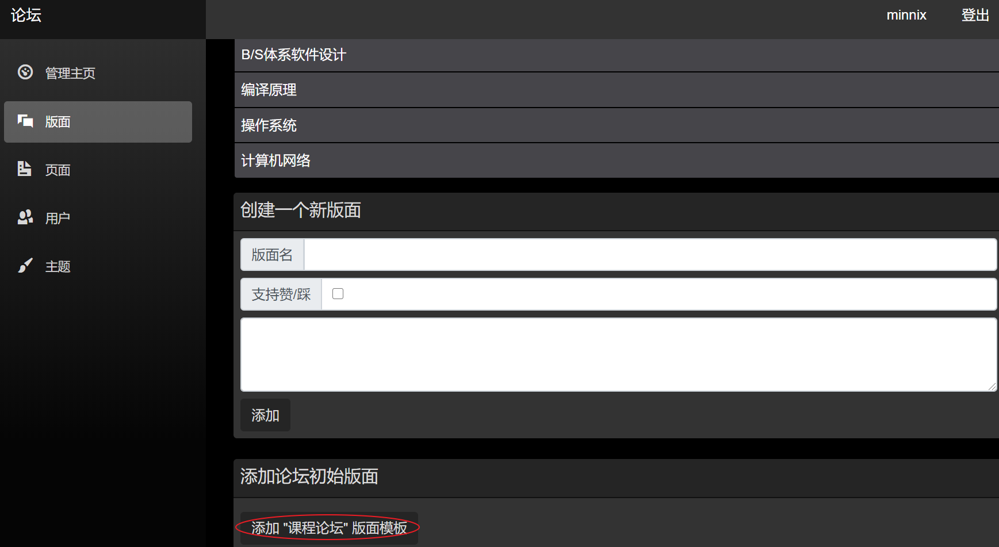

### 用户相关：

第一个注册的用户即为管理者，拥有管理权限，后续可以由管理员改变用户身份；

### 数据相关：

直接运行项目，浏览器会提醒初始化数据库，按提示初始化即可；

但是这样还没有版面，在管理界面可以进行一件添加(如下图)，当然也可以自己建版面。

### 功能相关：

#### 大致实现的功能：

论坛公告 发贴功能 回帖留言

#### 还未实现的功能：

文章管理 帖子检索

